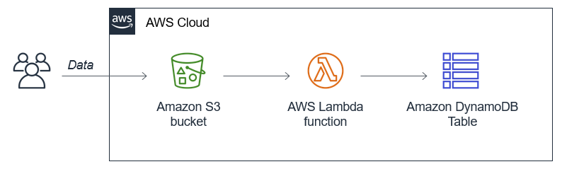
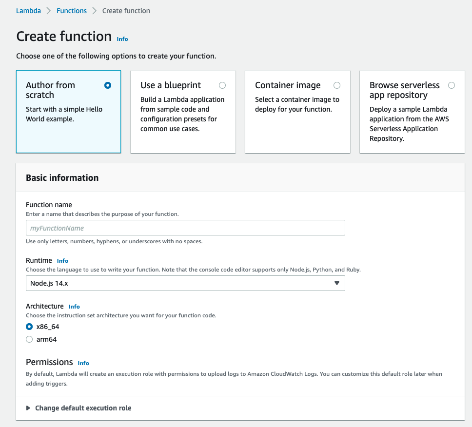
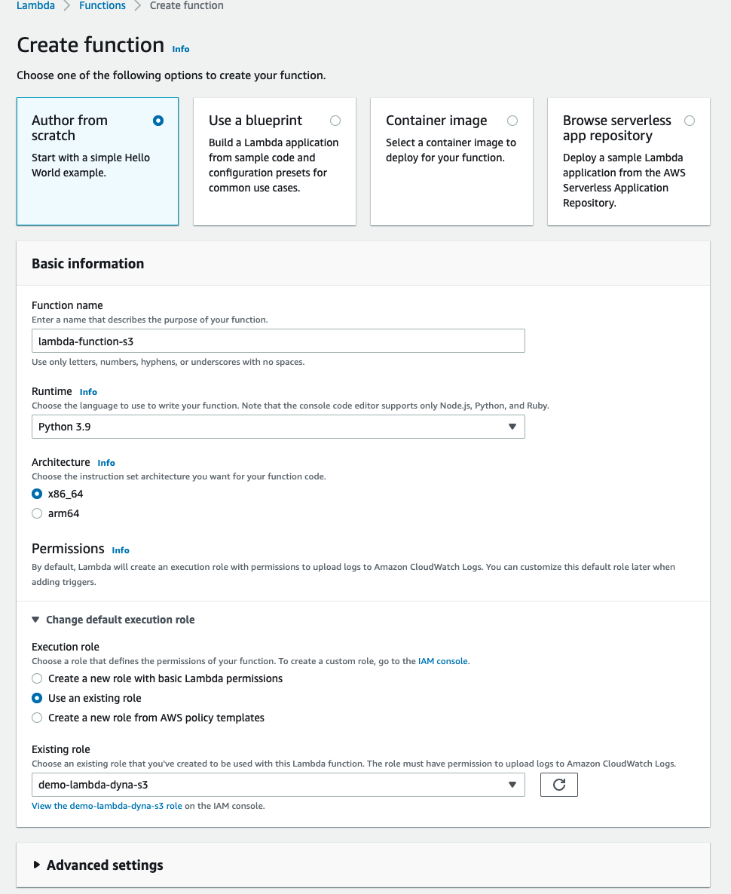
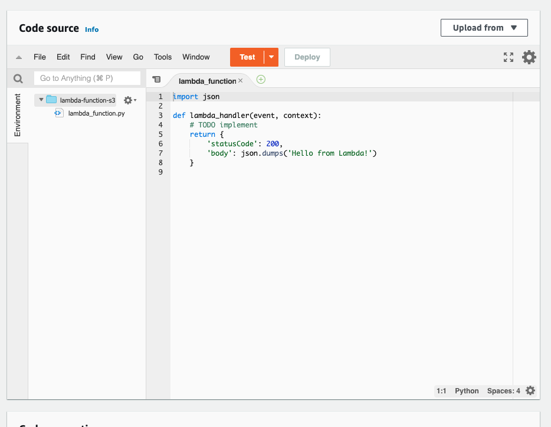
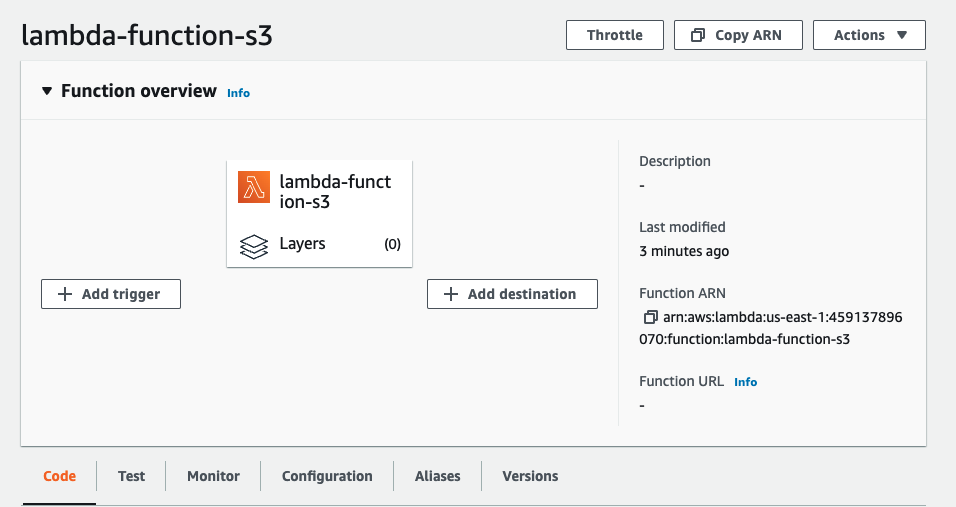
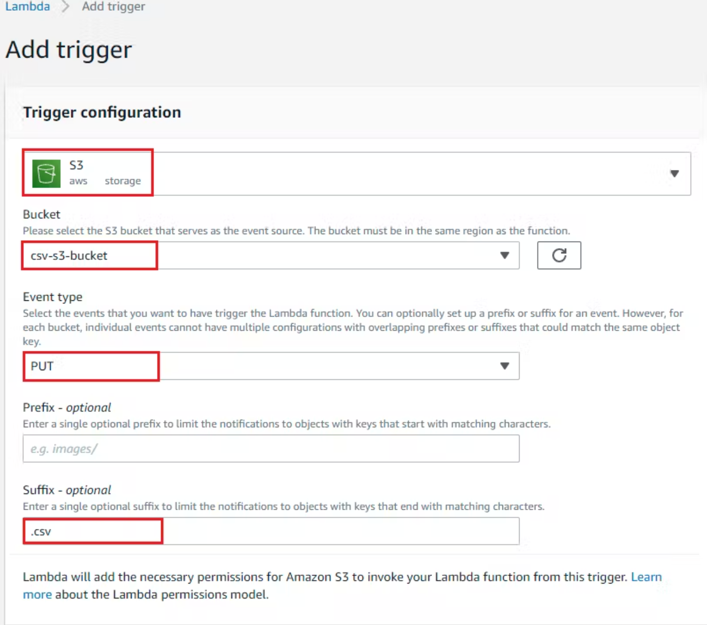

# Gestionando archivos CSV con AWS Bucket S3 e insertar en DynamoDB usando Lambda [Python]

Seleccionaremos el archivo CSV "demo.csv" lo subimos a un bucket-s3 creado previamente y procesaremos el archivo y lo enviaremos a la tabla de DynamoDB.

## Arquitectura

## Pasos

### Crear rol para Lambda

- Cree la política que se menciona a continuación. [Policy-Lambda](policy_iam_lambda.json)

### Crear bucket s3 

Hay dos formas para crearlas de forma manual directamente con la consola y automatica usando un script con python pero es importante tener las credenciales de aws

- Con la Consola AWS ir al servicio Bucket s3 - Crear Bucket 

** Opcion Automatizada

- Con el Script en Python [Python-s3](create_s3_bucket.py)

### Crear tabla de DynamoDB

De la misma manera que el s3 se puede realizar desde la consola , con lineas de comando o con scripts

- Con la Consola AWS ir al servicio dynamodb - Crear tabla
Table Name = user
Partition key = id
AttributeType: String
ReadCapacityUnits: 1
WriteCapacityUnits: 1

- Con el Script en Python [Python-dynamodb](create_Dynamodb.py)

### Crear Lambda

- Ir a la Consola AWS Lambda y haga clic en crear función

- Seleccionar Runtine Python 3.9 y Rol

- Vaya al editor de código y comience a escribir el código o puede copiarlo [Python-lambda](lambda_function.py).

### Establecer evento para el Bucket S3

- En la configuracion de función Lambda y haga clic en agregar trigger

- Seleccione el Bucket s3 que creo anteriormente

### Archivo CSV

- Cree un archivo .csv con los datos a continuación
[csv](demo.csv).

- Ahora cargue este archivo en el Bucket S3 y procesará los datos y los enviará a DynamoDB.

## Informacion Complementaria

Comenzando con AWS Boto3 [Medium](https://medium.com/@luiscelismx/comenzando-con-aws-boto3-876fd0d6686f#:~:text=Boto3%20consiste%20en%20un%20conjunto,los%20servicios%20web%20de%20Amazon.).

⌨️ con ❤️ por [roxsross](https://github.com/roxsross) 😊

No olvides revisar mi blog [roxsross](https://blog.295devops.com) 😊

y mi linktree [roxsross](https://roxs.295devops.com) 😊

"No se trata de cambiar el mundo, creo que creas un cambio pequeño, pero que te importe estás cambiando las cosas".

